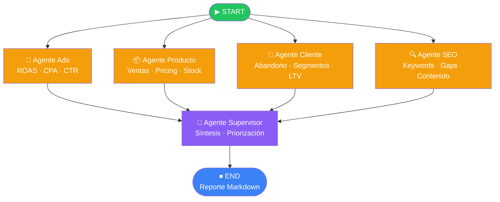

# Helix Growth Copilot

Sistema multi-agente con **LangGraph** para análisis de crecimiento de tiendas e-commerce.
Cruza 4 perspectivas especializadas (Ads, Producto, Cliente, SEO) y genera un reporte ejecutivo priorizado.

---

## Arquitectura del grafo



**Flujo:** Los 4 agentes especializados corren en **paralelo** (fan-out desde START).
El supervisor espera a todos y sintetiza el reporte final (fan-in).

---

## Stack técnico

| Componente | Tecnología |
|---|---|
| Orquestación | LangGraph `StateGraph` |
| LLM | Groq `llama-3.3-70b` → Cerebras `llama-3.3-70b` → Gemini 2.5 Flash |
| Fallback | `.with_retry(stop=2)` + `.with_fallbacks()` |
| Búsqueda web | Tavily |
| Configuración | `.env` + `python-dotenv` |
| Logging | Módulo `logging` estándar |

---

## Instalación

```bash
# 1. Clonar repo
git clone https://github.com/tu-usuario/helix-growth-copilot.git
cd helix-growth-copilot

# 2. Entorno virtual
python -m venv .venv
.venv\Scripts\activate        # Windows
# source .venv/bin/activate   # Linux/Mac

# 3. Dependencias
pip install -r requirements.txt

# 4. Configurar API keys
cp .env.example .env
# Editar .env con tus claves
```

---

## Uso

```bash
# Correr con el ejemplo incluido
python main.py

# Con input personalizado
python main.py --input mi_tienda.json

# Especificar ruta de salida
python main.py --input mi_tienda.json --output reports/junio_2026.md
```

El sistema corre **end-to-end con un solo comando** y guarda el reporte en `reports/`.

---

## Formato del input

Ver [`examples/sample_input.json`](examples/sample_input.json) para un ejemplo completo.

```json
{
  "store_name": "Nombre de la tienda",
  "period": "Período del análisis",
  "competitor_domain": "dominio.com",
  "campaigns": [...],
  "products": [...],
  "customer_metrics": {...}
}
```

---

## Reportes de ejemplo

- [`examples/reports/techmarket_junio_2026.md`](examples/reports/techmarket_junio_2026.md)
- [`examples/reports/moda_store_mayo_2026.md`](examples/reports/moda_store_mayo_2026.md)

---

## Observabilidad

Todos los agentes loguean con nivel y contexto:

```
2026-06-19 12:30:15 [INFO] helix.agents.ads — Agente Ads completado (2341 chars).
2026-06-19 12:30:18 [INFO] helix.agents.supervisor — Reporte final generado (4820 chars).
```

Configurar `LOG_LEVEL=DEBUG` en `.env` para ver el razonamiento interno de cada agente.

---

## Principios de diseño

- **Lógica de negocio en Python** — ROAS, CPA, abandono de carrito se calculan en código, no en el LLM.
- **Fallback en cascada** — si Groq falla, el sistema continúa con Cerebras; si este falla, con Gemini.
- **Errores no fatales aislados** — si un agente falla, el supervisor sintetiza con los análisis disponibles.
- **Reporte de emergencia** — si el supervisor LLM falla, se genera un reporte crudo sin LLM.
